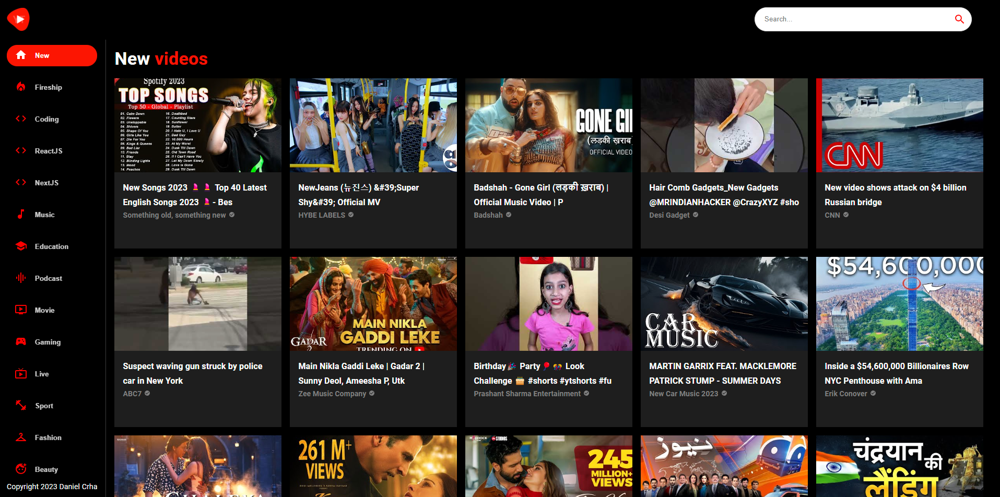
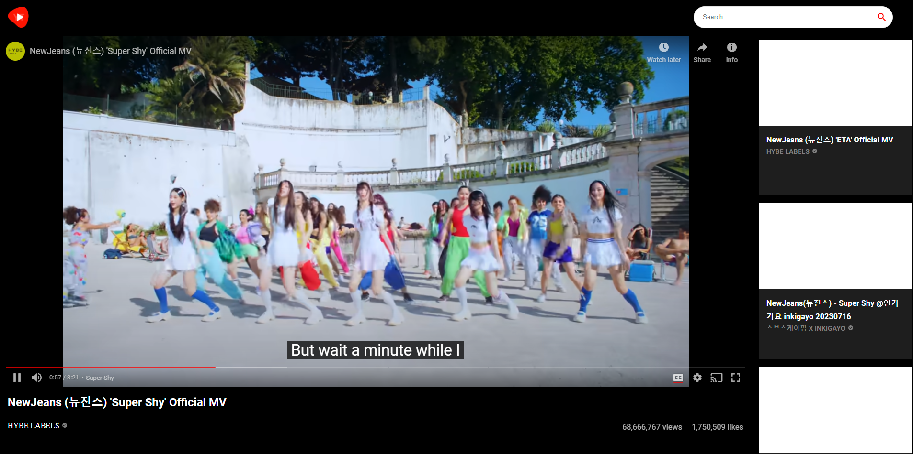
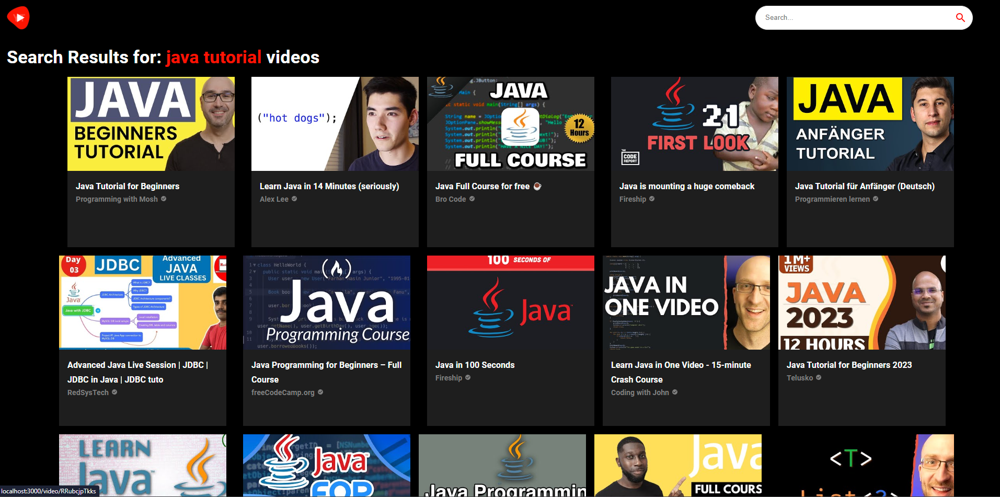

# YouTube Clone Application

This is a YouTube clone application built using React.js, Tailwind CSS, RapidAPI, and Material UI. With this application, users can browse and watch videos, search for specific content, and enjoy a familiar YouTube-like experience. This README provides information on how to set up and use the application.

## Table of Contents

- [Features](#features)
- [Demo](#demo)
- [Screenshots](#screenshots)
- [Getting Started](#getting-started)
  - [Prerequisites](#prerequisites)
  - [Installation](#installation)
- [Usage](#usage)
- [Technologies Used](#technologies-used)
- [Contributing](#contributing)
- [License](#license)

## Features

- Browse and watch videos from a YouTube-like interface.
- Search for videos based on keywords.
- Responsive design for seamless usage across devices.
- Integration with RapidAPI for fetching video data.
- Utilizes Material UI components for a polished user interface.
- Efficiently styled using Tailwind CSS.

## Demo

Check out the live demo of the YouTube Clone Application [here](https://your-demo-link.com).

## Screenshots

_Screenshot 1: Home Page_

_Screenshot 2: Video Playback_

_Screenshot 3: Search Results_

## Getting Started

Follow these instructions to set up and run the application on your local machine.

### Prerequisites

- Node.js and npm installed on your system.
- RapidAPI API key. You can obtain it by signing up on the RapidAPI platform.

### Installation

1. Clone the repository:

`git clone https://github.com/your-username/youtube_clone.git`

2. Navigate to the project directory:

`cd youtube_clone`

3. Install the dependencies:

`npm install`

4. Create a .env file in the root directory and add your RapidAPI API key:

`REACT_APP_RAPIDAPI_KEY=your-api-key`

5. Start the development server:

   `npm start`

   Open your web browser and navigate to http://localhost:3000 to see the application in action.

## Usage

    Upon opening the application, you will land on the home page where you can browse recommended videos.
    Use the search bar to look for specific videos based on keywords.
    Click on a video to start playing it.
    Enjoy the seamless YouTube-like experience!

## Technologies Used

    React.js
    Tailwind CSS
    RapidAPI
    Material UI
